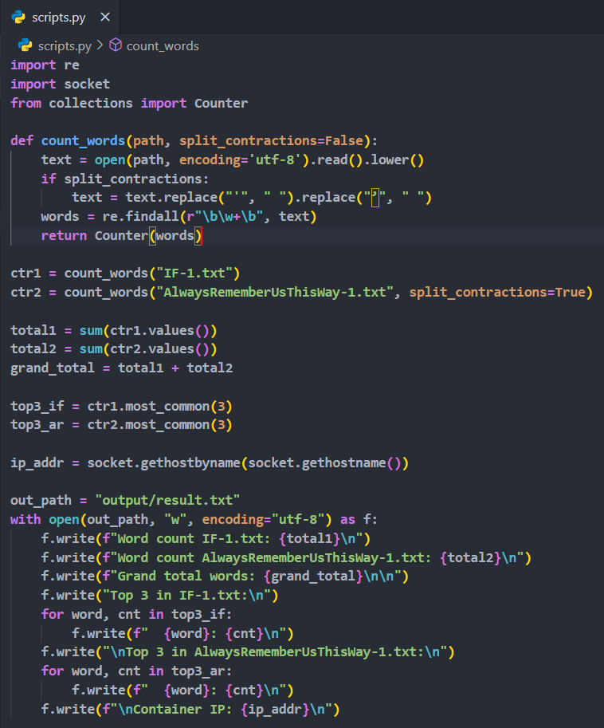
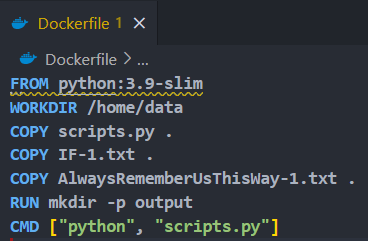
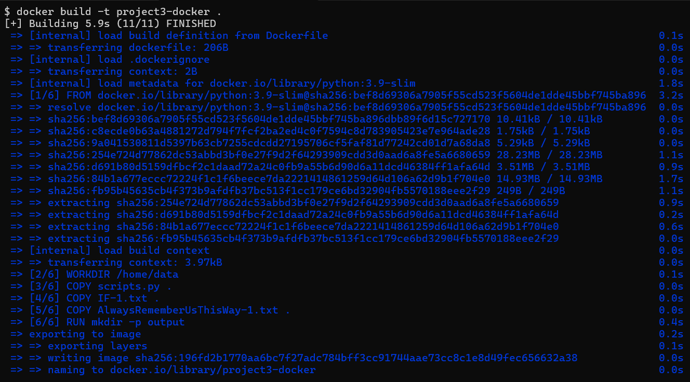
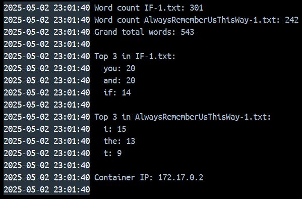

# Screenshots

The .tar file has been compressed into a .zip file to upload to GitHub

Image 1 – scripts.py in the editor, showing the word-count and output logic

Image 2 – Dockerfile contents (base image, workdir, COPY, mkdir, CMD)

Image 3 – Terminal output from docker build -t project3-docker . (build steps finishing)

Image 4 – Console output after docker run, showing word counts, top-3 words, and container IP

